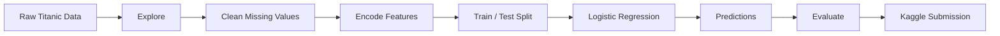

<div align="center">

# 🚢 TITANIC — SURVIVAL PREDICTION

### *Can a machine learn who survives?*

<br>


<br><br>

**A first-principles machine learning project built around the legendary Titanic dataset.**

[ Notebook ](#-the-notebook) · [ Results ](#-results) · [ Pipeline ](#-the-pipeline) · [ Roadmap ](#-whats-next)

</div>

---

## ⚡ THE MISSION

The question is simple:

> **Given what we know about a passenger, can a machine predict whether they survived?**

This project takes the classic Titanic dataset and turns raw passenger information into a working machine learning model.

No pre-built prediction service.

No black-box API.

Just **Python → data → features → model → prediction.**

---

## 🎯 THE RESULT

<div align="center">

| Metric              |          Score          |
| :------------------ | :---------------------: |
| 🧪 Local Validation |        **81.0%**        |
| 🏆 Kaggle Score     |        **76.7%**        |
| 🤖 Model            | **Logistic Regression** |
| 📦 Dataset          |       **Titanic**       |

</div>

> [!IMPORTANT]
> The **81.0%** score comes from my own 80/20 validation split, while **76.7%** is the score obtained from Kaggle's unseen test data.

That gap is not something to hide.

It's actually one of the most important things this project demonstrates:

**A model performing well on one validation split does not guarantee identical performance on unseen data.**

---

# 🧠 THE PIPELINE



---

# 🔬 WHAT GOES INTO THE MODEL?

The model learns from passenger information such as:

| Feature    | Meaning                   |
| :--------- | :------------------------ |
| `Pclass`   | Passenger class           |
| `Sex`      | Passenger sex             |
| `Age`      | Passenger age             |
| `SibSp`    | Siblings / spouses aboard |
| `Parch`    | Parents / children aboard |
| `Fare`     | Ticket fare               |
| `Embarked` | Port of embarkation       |

### Target

```text
Survived

0 → Did not survive
1 → Survived
```

---

# 🧹 DATA PREPROCESSING

Raw data isn't immediately usable by a machine learning algorithm.

So the dataset goes through a cleanup stage.

### Missing values

**Age**

Missing ages were replaced with the median age.

**Embarked**

Missing embarkation values were filled with `S`.

**Cabin**

The `Cabin` feature was removed because a very large proportion of its values were missing.

### Categorical data

`Sex` was converted into numerical form:

```text
male   → 1
female → 0
```

`Embarked` was transformed using one-hot encoding:

```text
Embarked_C
Embarked_Q
Embarked_S
```

### Removed features

For this first model, the following were excluded:

```text
PassengerId
Name
Ticket
Cabin
```

---

# 🤖 THE MODEL

## Logistic Regression

For Version 1, I chose **Logistic Regression**.

Why?

Because the goal wasn't just to get a score.

The goal was to understand the complete machine learning workflow.

The model learns relationships between the passenger features and the binary target:

```text
Survived = 0
Survived = 1
```

The basic training process is:

```python
model = LogisticRegression(max_iter=1000)

model.fit(X_train, y_train)

predictions = model.predict(X_test)
```

---

# 📊 RESULTS

## Local validation

The dataset was divided into:

```text
80% → Training
20% → Validation
```

Result:

### `81.0%`

---

## Kaggle

The trained model was then used to predict the 418 passengers in Kaggle's hidden test dataset.

Result:

### `76.7%`

The generated predictions were saved as:

```text
submission.csv
```

and submitted to the Titanic competition.

---

# 🧩 PROJECT STRUCTURE

```text
titanic-survival-prediction/
│
├── 📓 proj1.ipynb
│   └── Complete machine learning workflow
│
├── 📄 submission.csv
│   └── Kaggle predictions
│
└── 📖 README.md
    └── Project documentation
```

---

# 🧪 WHAT I ACTUALLY LEARNED

This project wasn't just about getting an accuracy number.

It taught me how the pieces of a machine learning project connect:

```text
DATA
  ↓
UNDERSTANDING
  ↓
CLEANING
  ↓
FEATURES
  ↓
TRAINING
  ↓
PREDICTION
  ↓
EVALUATION
  ↓
ITERATION
```

### Key concepts learned

* Dataset exploration
* Missing-value handling
* Feature selection
* Categorical encoding
* Training/testing splits
* Logistic Regression
* Model fitting
* Predictions
* Accuracy evaluation
* Kaggle submissions
* Generalization to unseen data

---

# 🗺️ WHAT'S NEXT?

This is **Version 1**.

And honestly, there's a lot of room to push it further.

### Version 2

* [ ] Random Forest
* [ ] Decision Tree
* [ ] Compare multiple models
* [ ] Feature importance

### Version 3

* [ ] `FamilySize`
* [ ] `IsAlone`
* [ ] Passenger titles from `Name`
* [ ] Better fare features
* [ ] Better age handling

### Version 4

* [ ] Proper preprocessing pipeline
* [ ] Cross-validation
* [ ] Hyperparameter tuning
* [ ] Model comparison
* [ ] Push Kaggle score higher

---

# 🧠 THE REAL GOAL

The objective isn't:

> **"Get the highest Titanic score possible."**

It's:

> **"Understand why the model works, why it fails, and how each change affects the result."**

This repository documents that progression.

---

<details>
<summary><b>🔍 Why Logistic Regression?</b></summary>

<br>

Logistic Regression is a strong starting point for binary classification problems.

Titanic survival is naturally binary:

```text
0 → No
1 → Yes
```

It is also simple enough to understand without hiding the learning process behind a complicated algorithm.

As the project evolves, more advanced models can be compared against this baseline.

</details>

<details>
<summary><b>📈 Why are the Kaggle and local scores different?</b></summary>

<br>

The local score was calculated using a validation split from the training dataset.

Kaggle evaluates the submitted predictions against a separate hidden test set.

Therefore:

```text
Local validation ≠ Kaggle evaluation
```

The difference is a useful reminder that machine learning models need to generalize beyond the data used during development.

</details>

<details>
<summary><b>🚀 Future experiments</b></summary>

<br>

The next stage of the project is experimentation.

Instead of randomly changing the code, each improvement should answer a question:

**Does this feature contain useful information?**

**Does this model generalize better?**

**Does this preprocessing method improve performance?**

**Does the Kaggle score actually improve?**

That turns the project from a one-time notebook into an iterative ML experiment.

</details>

---

# 🏁 STATUS

<div align="center">

### `VERSION 1.0`

**WORKING MODEL · KAGGLE SUBMITTED · BASELINE ESTABLISHED**

<br>

**81.0%** local validation
**76.7%** Kaggle

<br>

*The ship has sailed. The model is just getting started.*

</div>

---

<div align="center">

### 👨‍💻 Built by Rahul

**Learning Machine Learning — one model at a time.**

</div>
